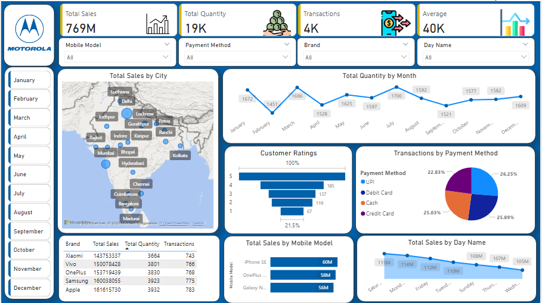

# 📊 Motorola Sales Analysis – Interactive Power BI Dashboard  

---

## 🔍 Project Overview  
This project focuses on **analyzing Motorola’s sales performance** across multiple dimensions using **Power BI**.  
The goal was to uncover key business insights through **data modeling, DAX measures, and interactive visualizations**.  

---

## 🛠 Tools & Technologies Used  
- **Power BI** – Data modeling, DAX, interactive dashboards  
- **Excel** – Raw sales dataset preparation  
- **DAX Functions** – Custom KPIs and calculated measures  

---

## 📂 Business Requirements  
The dashboard was designed to help stakeholders:  
- Track **overall sales performance** across time and regions  
- Analyze sales by **city, brand, and payment method**  
- Identify **top-performing categories & customer trends**  
- Provide decision-makers with **interactive visuals** for business strategy  

---

## ✅ Key KPIs  
- **Total Sales** – Overall revenue generated  
- **Total Quantity Sold** – Items sold across all cities  
- **Average Transaction Value** – Revenue per transaction  
- **Top Cities / Regions by Sales**  
- **Top Payment Methods Used**  

---

## 📊 Analysis Performed  
- Sales breakdown by **City & Region**  
- Sales trend across **different brands**  
- **Payment method** preferences of customers  
- Revenue contribution by **top-performing cities**  
- Sales trend across **time periods**  

---

## 📸 Dashboard Preview  

### Power BI Dashboard  
  

---

## 🔗 Live Project Access  
- 🖼️ **Power BI Dashboard (Preview):** See screenshot above  
- 📂 **PBIX File:** [Download from GitHub](https://github.com/Priyanka-Rawat890/Sales_Interactive_Dashboard/blob/main/PowerBI%20Project%20-%20Mobile%20Sales%20Dashboard.pbix)  

---

## 📁 Project Workflow  
1. Imported raw Motorola sales data (Excel format)  
2. Cleaned and prepared dataset for modeling  
3. Created data model in Power BI  
4. Designed DAX measures for sales KPIs  
5. Built interactive dashboard with filters and visuals  

---

## 📊 Key Insights  
- Certain **cities contributed disproportionately** to total sales  
- **Brand-level analysis** highlighted performance differences  
- Customers preferred **digital payment methods** in top regions  
- Sales distribution revealed **seasonal purchasing patterns**  

---

## 👩‍💼 Author  
**Priyanka Rawat** – Aspiring Data Analyst  
- 📌 [LinkedIn](https://linkedin.com/in/priyanka-rawat-398bb4337)  
- 💻 [GitHub](https://github.com/Priyanka-Rawat890)  
